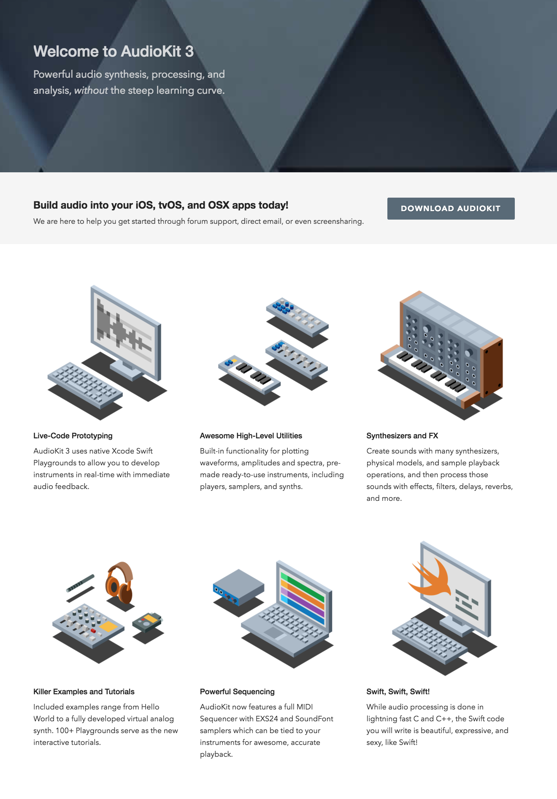
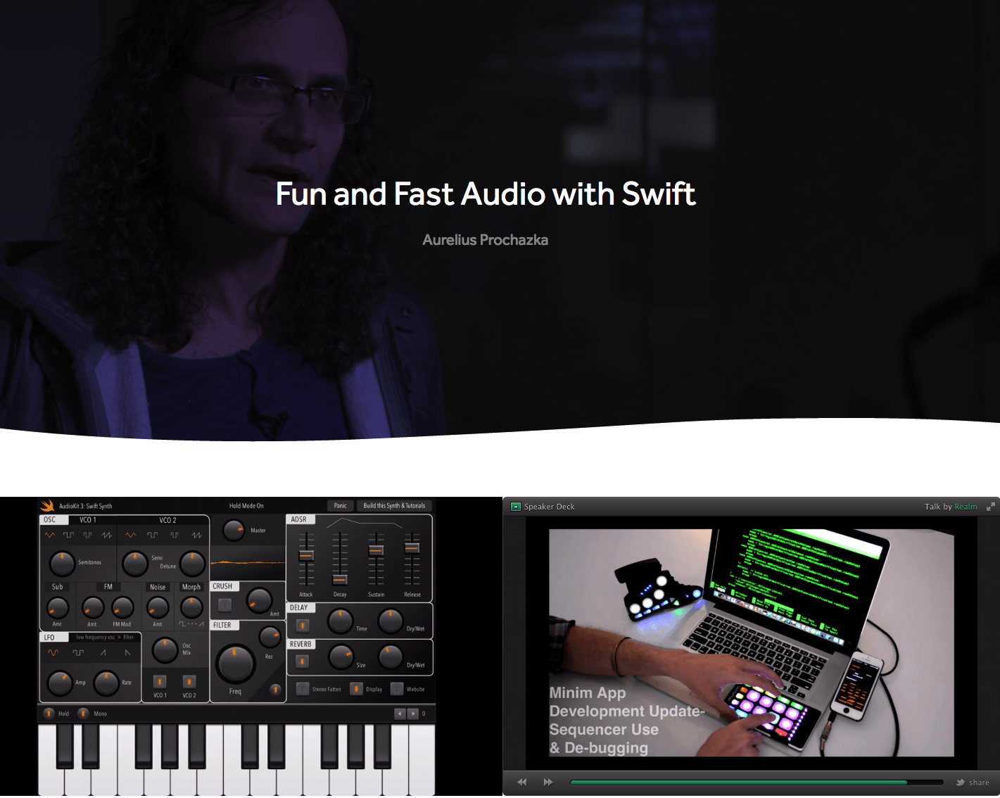
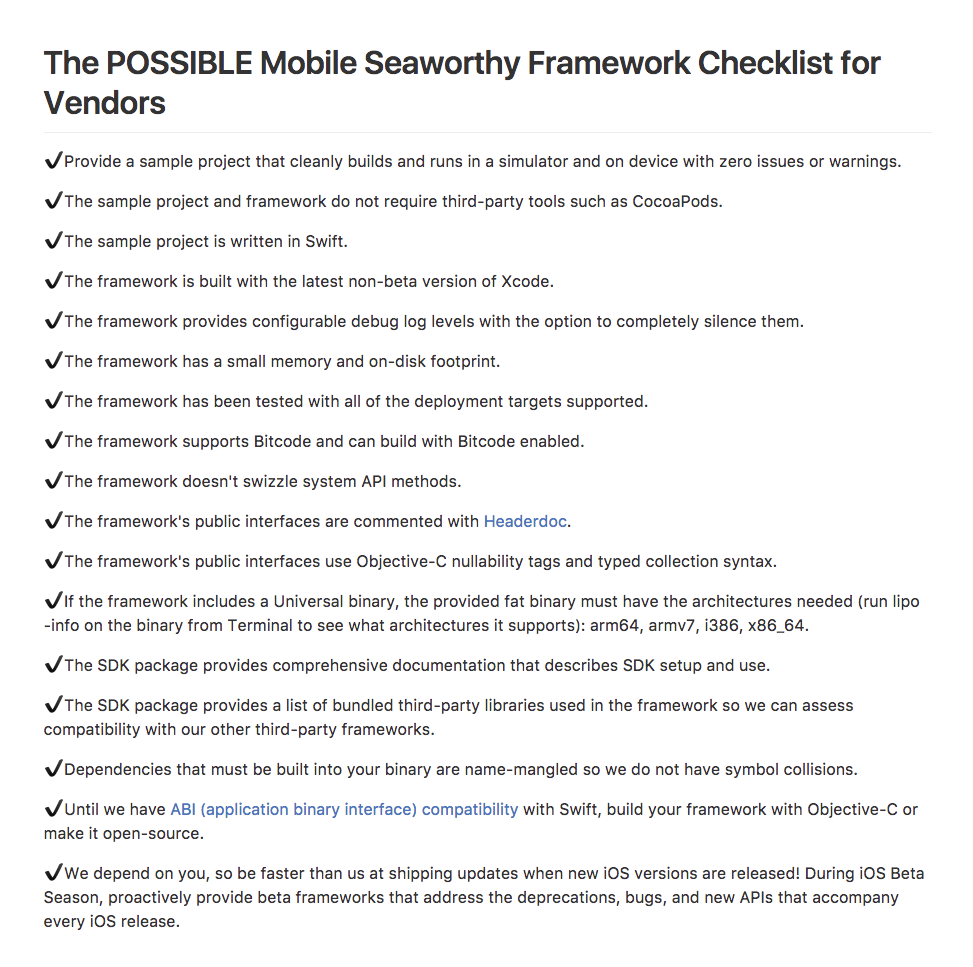
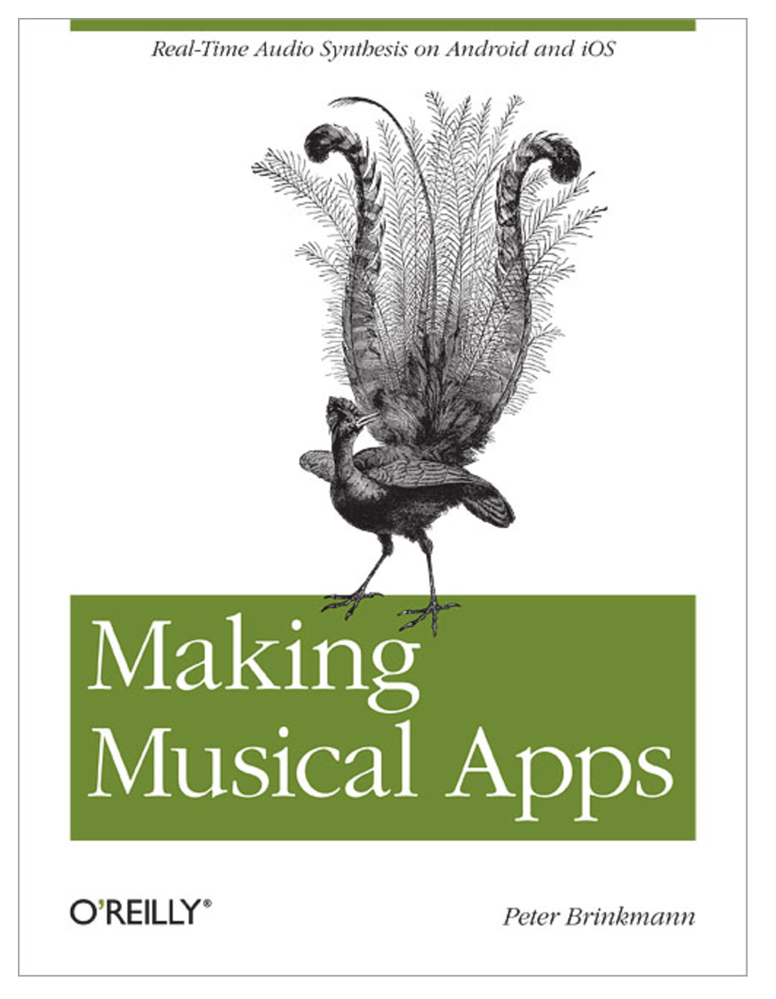
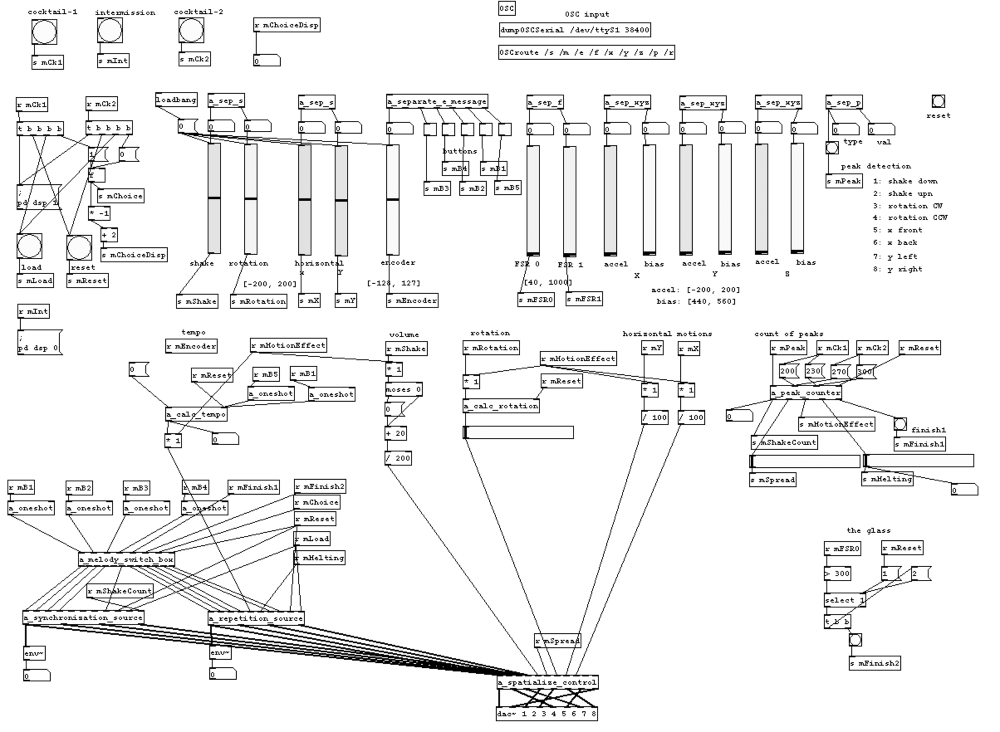
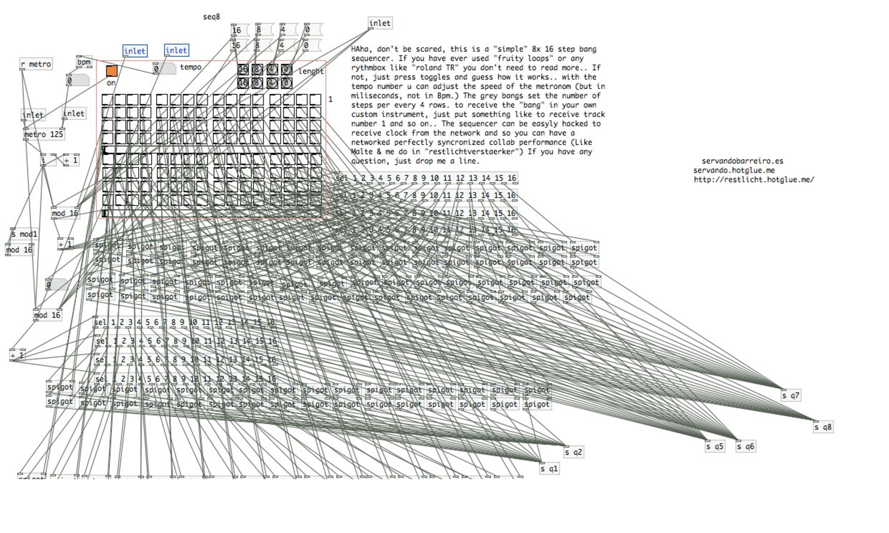

footer: Aurelius Prochazka / [aure@aure.com](http://aure.com) / [@AudioKitMan](http://twitter.com/AudioKitMan) / [AudioKit.io](http://audiokit.io)
slidenumbers: true

# [fit] Highly-Desirable
# [fit] Frameworks

---

# AudioKit

---

# AudioKit

 

---

# Seaworthy Framework Checklist for Vendors

Authors:
[POSSIBLE Mobile Team](https://possiblemobile.com/2016/05/ios-frameworks-part-1/)
(Sean Coleman, Ada Turner, et al)

Link:
[gist.github.com/POMBuilds/eb...](https://gist.github.com/POMBuilds/eb439cfa2300b080c7b75006ab69265e)

---

# Why start a framework at all?

---

# [fit] You're Gonna Want To Share It
# [fit] ❤️ 💰 🛠

---

# [fit] Ship it

---

# Understand the Goals of the end user

- Get something done without becoming an expert
- Trust their tools
- Know that their tools will not expire
- Have support when the s#it hits the fan
- Quickly evaluate their options

---

# Know Thyself

---

# What makes a framework desirable?

---

# Empowering

- Does something new

- Does something better

- Works multi-platform

---

# !!Not non-empowering?

- Is not kryptonite

---

# Kryptonite?

---

# Kryptonite

---

# Kryptonite!

---

# Learnable

- Adheres to best practices *

- Approachable

- Deeply documented

- Well-maintained, clear code

---

# Learnable, pt. 2

- Contains easily runable projects

- Contains Playgrounds

- Has a community support system

---

# Trustworthy

- Reliable

- Efficient

- Transparent

- Responsive

---

# Checklist

[github.com/aure/frameworks](https://github.com/aure/frameworks/)

